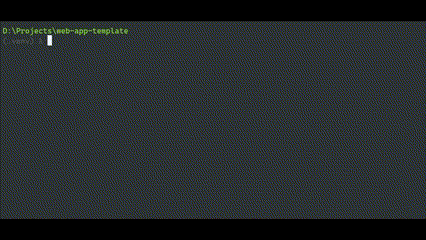

.. _guide-quickstart:

Getting Started
===============

Prept is a CLI tool for managing boilerplates and reusing them to bootstrap
complex projects with a single command.

This tutorial focuses on installing Prept, setting up a basic boilerplate,
and finally bootstrapping a project from it.

Installation
------------

Prept can be installed through pip or another Python package manager::

    $ python -m pip install prept

Note that Python 3.9 or a higher version is required for installing Prept.

Jinja Templates
~~~~~~~~~~~~~~~

If you intend to use Jinja templates in your boilerplates, you will be requiring
Jinja2 to be installed as well.

You can either install it directly or install Prept along with Jinja2 in a single command::

    $ python -m pip install prept[jinja]

Usage
-----

Prept operates on boilerplates which are simply directories containing source
code files that can be reused.

Initializing Boilerplate
~~~~~~~~~~~~~~~~~~~~~~~~

To show this, below is an example Python web app template in a directory named
``web-app-template``::

    web-app-template
    │
    ├── routers
    │   ├── users.py
    │   ├── messages.py
    │   └── groups.py
    │
    ├── utils.py
    └── main.py

We can initialize this directory as a Prept boilerplate by running the :program:`prept init`
command in this directory::

    $ prept init python-web-app

``python-web-app`` is the name of boilerplate that will be used to refer to it when
generating a project from this boilerplate.

This command creates a boilerplate configuration file ``preptconfig.json``::

    web-app-template
    │
    ├── routers
    │   ├── users.py
    │   ├── messages.py
    │   └── groups.py
    │
    ├── preptconfig.json
    ├── utils.py
    └── main.py

.. image:: ../_assets/prept_init.gif
    :alt: Usage of prept init command

Generating Project
~~~~~~~~~~~~~~~~~~

We can now use :program:`prept new` command supplying this directory's path as argument
along with output directory to bootstrap a project from this boilerplate.

The following command is ran in directory where ``web-app-template`` directory is
present::

    $ prept new .\web-app-template -O my-web-app

``my-web-app`` is the name of output directory where project files are created.

.. image:: ../_assets/prept_new.gif
    :alt: Usage of prept new command

Installing Boilerplate
~~~~~~~~~~~~~~~~~~~~~~

Repeatedly using paths such as ``.\web-app-template`` is not practical in most cases. Ideally, you
would want to have a way of generating project from this boilerplate by simply referring to its
name.

This can be achieved by globally installing the boilerplate through :program:`prept install` command. This
command takes the boilerplate path as argument which is to be installed.

The following command is ran in ``web-app-template`` boilerplate directory::

    $ prept install .

``.`` indicates that boilerplate is located in current working directory.

We can now use :program:`prept new python-web-app` command anywhere to quickly generate
project from this boilerplate!

.. image:: ../_assets/prept_new_installed.gif
    :alt: Usage of prept new command with installed boilerplate

.. tip::

    You can use :program:`prept uninstall` to uninstall a boilerplate and :program:`prept list`
    to see the list of installed boilerplates.

Template Files
~~~~~~~~~~~~~~

The following is the content of ``main.py``::

    import flask

    app = flask.Flask(__name__)

    @app.route('GET', '/')
    def index():
        return {'message': 'Welcome to $APP_NAME'}

    if __name__ == '__main__':
        app.run(debug=True)

Here, we are expecting that ``$APP_NAME`` can be replaced with a value that
user can provide at the time of project generation.

This can be achieved through what Prept calls "templates."

- ``main.py`` is called the **template file**.
- ``APP_NAME`` is called the **template variable**.

Template files are processed by a middleware called **template provider** that
processes the file content and injects the variable values into it. Each template
provider has its own template rules and syntax.

In this case, we are using ``stringsub`` template provider which provide variable
substitutions using the dollar sign ($) syntax as we used in main.py content above.

.. note::

    In complex applications, Jinja templates are used which are more powerful and
    flexible. They are provided by the ``jinja2`` provider.

We define template provider, files, and variables in preptconfig.json. Here is the
updated configuration::

    {
        "name": "python-web-app",
        "template_provider": "stringsub",
        "template_files": ["main.py"],
        "template_variables": {
            "APP_NAME": {
                "summary": "The name of application.",
                "required": false,
                "default": "Simple Web Application"
            }
        }
    }

.. tip::

    ``template_files`` is an array of gitignore-like path patterns which means
    you can provide a name of directory and all files under this directory will
    be defined as template files.

    This also allows passing ``"*""`` which defines all files in boilerplate
    as template. However, this practice is not recommended.

.. note::

    As we have updated the boilerplate, we must install it again through :program:`prept install`
    command if it was previously installed to reflect the changes in global installation.

We can now run :program:`prept new` command and provide the value for ``APP_NAME`` variable
for it to be injected into ``main.py``.

.. code-block:: sh

    $ prept new python-web-app -O my-app
    INFO    Generating project from boilerplate: python-web-app
    INFO    No existing directory found. Creating project directory at 'D:\Projects\my-app'
    INFO    Successfully created project directory at D:\Projects\my-app
    INFO    Processing template variables
    OPTION  The name of application.

            APP_NAME (optional) [Simple Web Application]: Chat Application

    INFO    Creating project files at 'D:\Projects\my-app'

        ├── Creating my-app\main.py ... DONE
        ├── Applying template on my-app\main.py ... DONE
        ├── Creating my-app\routers\groups.py ... DONE
        ├── Creating my-app\routers\messages.py ... DONE
        ├── Creating my-app\routers\users.py ... DONE
        ├── Creating my-app\utils.py ... DONE

    SUCCESS Successfully generated project from 'python-web-app' boilerplate at 'D:\Projects\my-app'

.. image:: ../_assets/prept_new_template.gif
    :alt: Usage of prept new command with template variables

The generated ``main.py`` in project output directory has the following content::

    import flask

    app = flask.Flask(__name__)

    @app.route('GET', '/')
    def index():
        return {'message': 'Welcome to Chat Application'}

    if __name__ == '__main__':
        app.run(debug=True)

As you can see, ``$APP_NAME`` was replaced with ``Chat Application``.

Next Steps
----------

Prept comes with an array of useful features and customization capabilities. Listing them
all here is not possible.

Take a look at our :ref:`guide` section that contains pages covering the features of Prept
and various other details.
